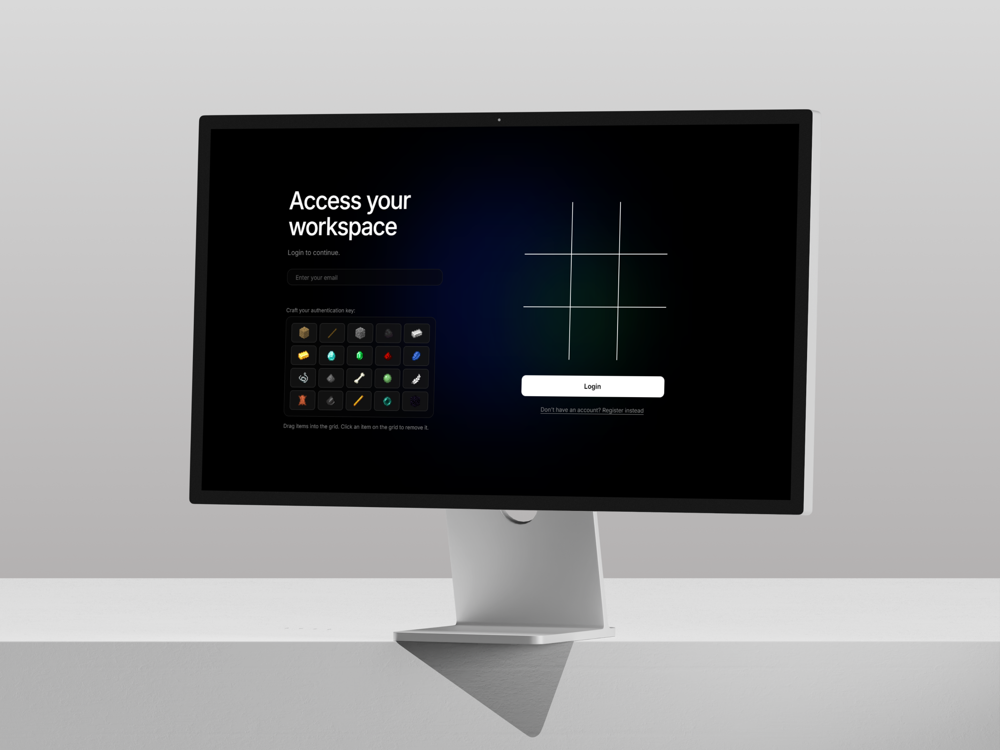
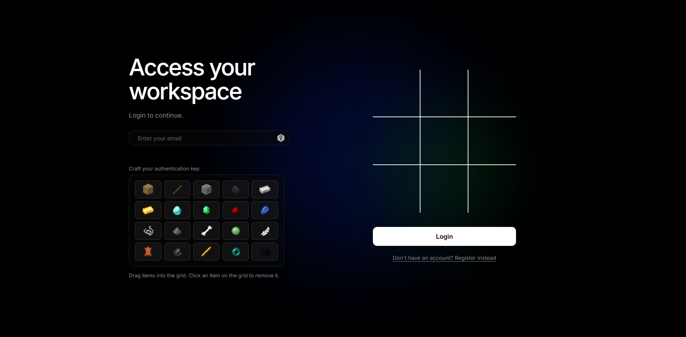
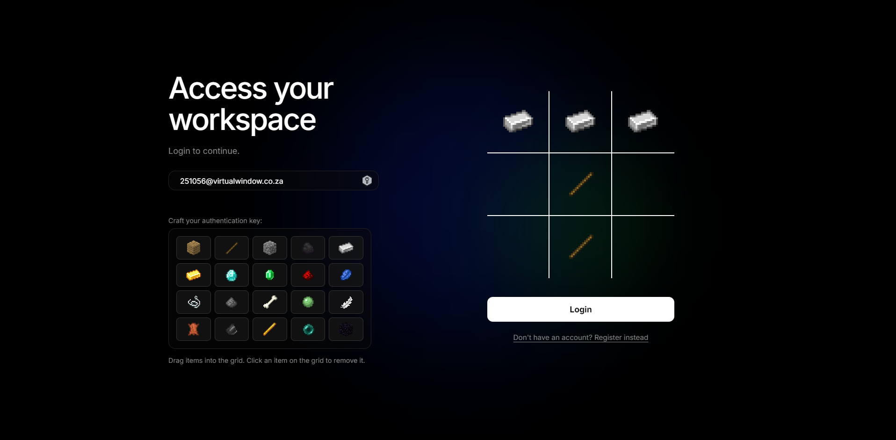
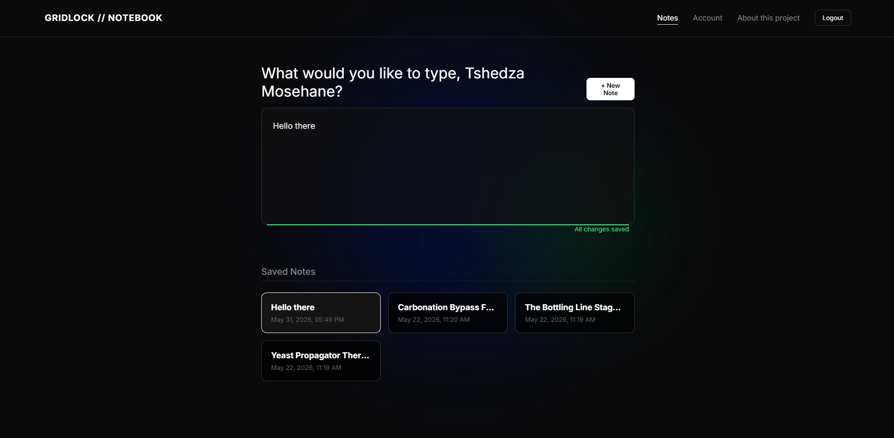
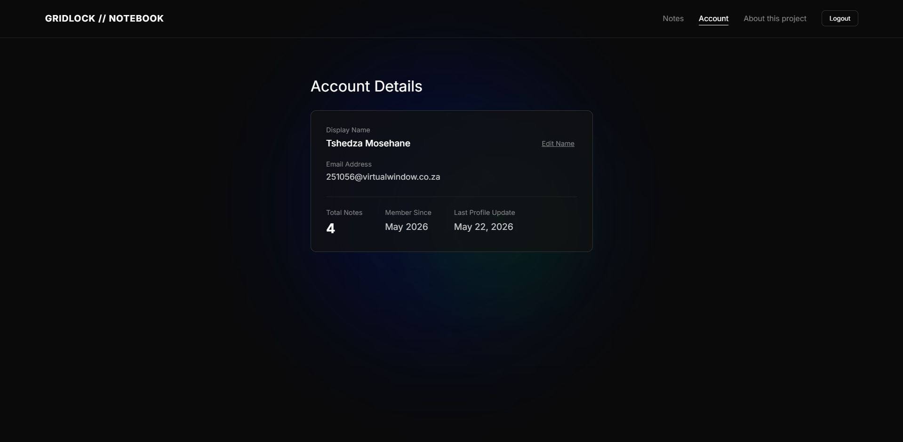

# GRIDLOCK // Notebook

Gridlock is a full-stack, secure notebook application built to explore alternative authentication mechanics. Rather than relying on traditional alphanumeric passwords, Gridlock introduces a spatial, visually-driven login system.

## Description

Gridlock takes standard web dashboard mechanics and makes them interactive. Built on the MERN stack, the application securely authenticates users via JWTs and provides them with a personal dashboard. Instead of a standard UI, users interact with an `InventoryGrid` and a `CraftingGrid`, utilizing specific items and recipes to manage their workspace and notes. 

The security model utilizes industry-standard practices: user credentials are encrypted, and sessions are maintained securely via the backend. The project demonstrates complex state management in React, drag-and-drop or grid-based interactions, and a fully documented REST API handling user data and note persistence.

## Screenshots
### Login: Blank

*The login interface. The sign-up screen is nearly identical, with just an additional field for your name.*
### Login: Fields Populated

*Users drag and drop items from their inventory into the grid to create a pattern. Clicking an item in the grid removes it.*
### Dasboard

*A basic note-taking dashboard to give the application practical, everyday utility.*
### Account Details

*The account details page, verifying the active session and matching the display name shown on the dashboard.*

---

## Demo Video

### Google Drive Link to Video:

[Demonstration Video Link](https://drive.google.com/drive/folders/13gsu4sXJ3UXWrUH-LM15hsbf9oEEOKk8?usp=sharing) 

---

## Table of Contents

- [Description](#description)
- [How It Works](#how-it-works)
- [Features](#features)
- [Tech Stack](#tech-stack)
- [Setup & Installation](#setup--installation)
- [API Endpoints](#api-endpoints)
- [Data Model](#data-model)
- [Project Structure](#project-structure)
- [License](#license)
- [Acknowledgments](#acknowledgments)

---

## How It Works

Gridlock operates on a combination of secure data management and interactive UI elements:

- **Authentication**: Users log in or sign up via the `AuthScreen`. The Express backend issues a secure token, granting access to the protected `Dashboard`.
- **The Dashboard**: Once inside, users are greeted by the `Dashboard` and the `GlowOrb` component. Here, they can manage personal `Notes`.
- **The Grid System**: The core interactive element involves the `InventoryGrid` and `CraftingGrid`. Using predefined `items.js`, users can combine elements (like Iron Ingots, Redstone, or Obsidian).

---

## Features

- Secure user registration and login flow.
- Protected routes ensuring only authenticated users can access the dashboard.
- Custom interactive `CraftingGrid` and `InventoryGrid` UI components.
- Note creation and management system tied to the user's account.
- Simple visual transitions using `TransitionScreen`.
- RESTful backend API built with Express.js.
- MongoDB database integration via Mongoose.
- Environment variable configuration via `.env`.

---

## Tech Stack

[](https://www.mongodb.com)
[](https://expressjs.com)
[](https://react.dev/)
[](https://nodejs.org/en)
[](https://www.javascript.com/)

| **Frontend**|  | **Backend** |  |
|---|---|---|---|
| **Technology** | **Purpose** | **Technology** | **Purpose** |
| React | UI framework | Node.js | Runtime environment |
| Custom Engine | Game/Grid logic (`engine.js`) | Express.js | Web framework and routing |
| React Hooks | State management (`useNotes.js`) | MongoDB | NoSQL database |
| CSS | Styling (`App.css`, `Dashboard.css`) | Mongoose | MongoDB object modelling |
| | | Custom Auth | Middleware verification (`auth.js`) |

---

## Setup & Installation

### Prerequisites

Ensure the following are installed on your machine:

- [Node.js](https://nodejs.org/)
- [MongoDB](https://www.mongodb.com/) 
- [Git](https://git-scm.com/)

### 1. Clone the Repository


```

```text
File created successfully.

```bash
git clone [https://github.com/your-username/gridlock.git](https://github.com/your-username/gridlock.git)
cd gridlock

```

### 2. Install Dependencies

```bash
# Install frontend dependencies
cd gridlock
npm install

# Install backend dependencies
cd ../server
npm install

```

### 3. Configure Environment Variables

Create `.env` files in both the client and server directories and fill in your values.

In `server/.env`, set:

```env
MONGODB_URI=your_mongodb_connection_string
JWT_SECRET=your_jwt_secret
PORT=5000

```

### 4. Run Both Servers

From the frontend directory:

```bash
npm start

```

From the `server` directory:

```bash
npm start

```

---

## API Endpoints

Base URL: `http://localhost:5000`

| Method | Endpoint | Description | Request Body |
| --- | --- | --- | --- |
| `POST` | `/api/auth/register` | Register a new user | `{ username, password }` |
| `POST` | `/api/auth/login` | Authenticate user and return token | `{ username, password }` |
| `GET` | `/api/notes` | Get all notes for the logged-in user | None (Requires Auth) |
| `POST` | `/api/notes` | Create a new note | `{ content, title }` |

---

## Data Model

Stored in MongoDB via Mongoose schemas:

* **User Model** (`User.js`):
* Handles storing user credentials securely.


* **Note Model** (`Note.js`):
* Stores the content and metadata for user notes, linked to the User who created them.


---

## Project Structure

```text
gridlock/
├── gridlock/                 # React frontend
│   ├── public/
│   │   └── images/           # Sprites (Diamond, Redstone, Obsidian, etc.)
│   ├── src/
│   │   ├── components/       # UI Components
│   │   │   ├── AuthScreen.jsx
│   │   │   ├── CraftingGrid.jsx
│   │   │   ├── Dashboard.jsx
│   │   │   ├── GlowOrb.jsx
│   │   │   ├── InventoryGrid.jsx
│   │   │   ├── ProtectedRoute.jsx
│   │   │   └── TransitionScreen.jsx
│   │   ├── data/             # Game/Grid data
│   │   │   ├── items.js
│   │   │   └── recipes.js
│   │   ├── hooks/
│   │   │   └── useNotes.js   # Custom React hook for fetching notes
│   │   ├── lib/
│   │   │   └── engine.js     # Core logic
│   │   ├── pages/
│   │   │   ├── Account.jsx
│   │   │   └── AuthFlow.jsx
│   │   ├── App.js            # Root component
│   │   └── index.js          # React entry point
│   └── package.json
│
├── server/                   # Node.js + Express backend
│   ├── middleware/
│   │   └── auth.js           # Authentication verification
│   ├── models/
│   │   ├── Note.js           # Mongoose Note schema
│   │   └── User.js           # Mongoose User schema
│   ├── index.js              # Express app entry point
│   └── package.json
│
└── README.md

```

---

## License

This project is licensed under the [MIT License](https://opensource.org/licenses/MIT).

---

## Acknowledgments

Inspiration, code snippets, etc.
* **Mojang Studios** - The inventory and crafting mechanics are heavily inspired by the visual language and interaction design of Minecraft.
* **[Minecraft Wiki](https://minecraft.wiki/w/Item)** - For the foundational item sprites (Diamond, Redstone, etc.) used in the grid interface.
* **Open Window Institute** - For the environment and feedback that helped shape this project.
* A massive thank you to *Litchi N* for keeping me sane during those deep-dive debugging loops. xoxo
* **[awesome-readme](https://github.com/matiassingers/awesome-readme)** 4sXJ3UXWrUH-LM15hsbf9oEEOKk8?usp=sharing
